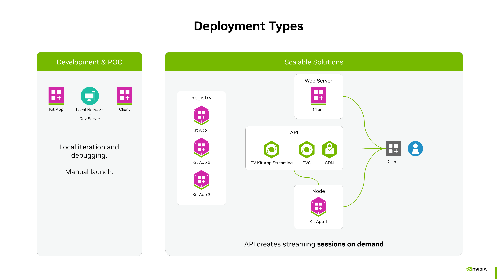
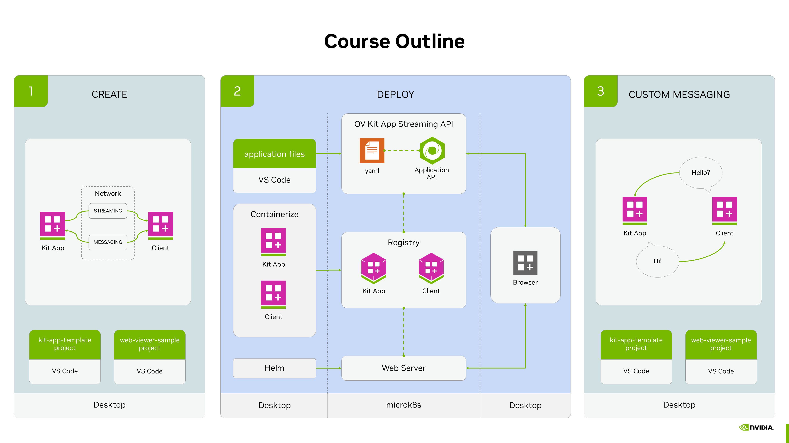

# Kit App Streaming
Course: Building and Deploying Digital Twin Applications With Omniverse Kit App Streaming

## Setup browser-based streaming.

Kit app streaming means pixels streaming a Kit app to a client and allowing for the two apps to communicate. This is a peer-to-peer solution: one Kit app streamed to one client.


For iterating and simpler proof-of-concept work, the deployment can be all local—running on a single workstation. For scalable solutions, we add an API that can launch a requested application on demand. Current APIs are Omniverse Kit App Streaming API (OKAS), Omniverse Cloud (OVC), and Graphics Delivery Network (GDN). OVC and GDN are managed by NVIDIA where GDN is great for Product Configurators, and OVC for demanding and massively scaled applications like Digital Twins.




For this course we narrow this down to web and Python development. The infrastructure and Omniverse Kit App Streaming API deployment has already been set up for us. Unlike a production environment that supports a disaggregated scalable solution, for this course we run everything on a single remote node. However, the general development and deployment steps are not different from a production environment.

The course is divided into three parts: first we create the Kit app and the web front end, then we deploy and test the solution, and finally we take a closer look at how to create custom communication between the apps.



Create USD Viewer From Template
```bash
cd kit-app-template
./repo.sh template new
#Use arrow keys to select: USD Viewer
#Build the app by running:
./repo.sh build
```

Prepare Front End Client: `web-viewer-sample`
```bash
cd web-viewer-sample
npm install #pulls dependencies and NVIDIA Omniverse WebRTC Streaming Library
```

We need to define the IP address that the client will use to connect and stream the Kit application. Open `web-viewer-sample/stream.config.json`. Note the IP address in the server field. This is the IP address the client will use to connect to the Kit app. For example
```bash
{
    "$comment": "source can be ` , ` local`  or ` stream` ",
    "source": "local",
    "stream":
    {
        "$comment": "Optional props if source is set to ` stream` .",
        "appServer": "",
        "streamServer": ""
    },
    "gfn": {
        "$comment": "Required props if source is set to ` gfn` .",
        "catalogClientId": "",
        "clientId": "",
        "cmsId": 0
    },
    "local": {
        "$comment": "Required props if source is set to ` local` .",
        "server": "20.163.55.176"
    }
}

```

## Test Run
Launch the Kit app in headless mode. Navigate to VS Code and the terminal for the kit-app-template project.
```bash
./repo.sh launch -- --no-window
#Select: my_company.my_usd_viewer_streaming.kit
```

Launch front end client, Navigate to VS Code and the terminal for the web-viewer-sample project.
```bash
npm run dev
```
Open the PORTS tab next to the TERMINAL tab in VS Code. hover over the URL for port 5173. Click the globe icon for Open in Browser. This should open a new browser tab.
Edit the URL by removing /proxy/8080 such that the URL ends with :5173. For example, http://x-ov-90-560-6.development.dli-infra.nvidia.com:5173/.

## Deploy
Containerize and push the app to a registry so the Omniverse Kit App Streaming API can make use of it