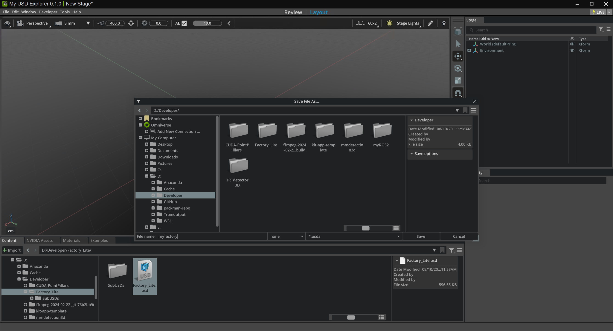
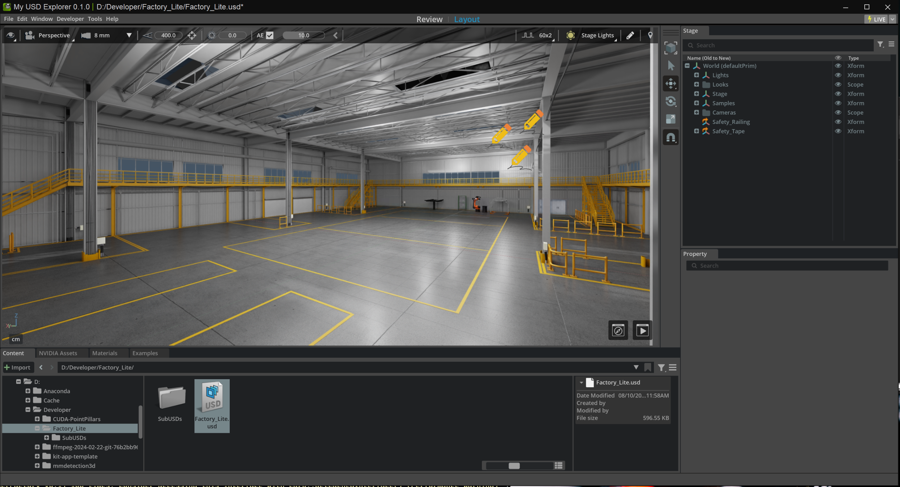

# Omniverse Digital Twins
## Course1: Extend Omniverse Kit Applications for Building Digital Twins
[link](https://learn.nvidia.com/courses/course-detail?course_id=course-v1:DLI+S-OV-13+V1)

Download these [Factory Assets](https://developer.nvidia.com/downloads/USD/dataset/Factory/Factory_Lite.zip) to your local drive, and extract the contents of the zip folder.

Use the custom application created from the USD Explorer template. Launch your custom application. At the opening screen, click New. This will open a new file in Layout mode.

Your application includes two modes, Review and Layout, which correspond to links at the top center of the screen. Review is for end users of your application who need to navigate, review and add comments to the digital twin. Layout is optimized for power users of your application who assemble large scenes and execute changes.

In Layout mode, open the file Factory_Lite.usd that you downloaded. Save the file as a .usda file.





Open the .usda file in VS Code or a text editor, and inspect its structure.
In the .usda file, search for the term “.usd”.

Rather than explicitly defining each mesh in the file, the Factory_Lite file references multiple USD files that contain individual items. These other USD files are located in the SubUSDs folder you downloaded as part of the Factory_Lite.zip file. 

In your application, navigate to the SubUSDs folder, and locate Vehicle_Hanger_Adjust.usd. Double-click it to open the asset in the viewport.

Save the asset as a .usda file.
Open the .usda file in VS Code, and inspect the file. The file contains a long list of vertex positions that define the asset’s shape in 3D space.

By having the Factory_Lite file reference individual USDs like Vehicle_Hanger_Adjust.usd, the Factory_Lite file itself is very lightweight and easy to edit. By keeping each asset in a separate USD file, it’s easier to update an individual asset without having to deal with the entire scene.

## Course2: Building and Deploying Digital Twin Applications With Omniverse Kit App Streaming
[link](https://learn.nvidia.com/courses/course-detail?course_id=course-v1:DLI+S-OV-43+V1)
Contains GPU hours

By leveraging NVIDIA Omniverse Kit App Streaming, you can stream these interactive 3D environments to web browsers and other front-end clients, facilitating remote real-time data visualization and remote collaboration and decision-making. We’ll be demonstrating how to create and deploy web-based applications using Omniverse’s Kit App Streaming sample.

By the end of this lab, you’ll be able to develop your own applications to enable real-time interaction and visualization, laying the groundwork for integrating IoT data and leveraging these technologies for actionable insights.

### Module 1: Create
#### Kit App
```bash
./repo.sh template new
```
Use arrow keys to select: USD Viewer
Build the app by running:
```bash
./repo.sh build
./repo.sh launch -- --no-window
```
Select: my_company.my_usd_viewer_streaming.kit

#### Web Front end
Prepare Front End Client: [web-viewer-sample](https://github.com/NVIDIA-Omniverse/web-viewer-sample)
 - Sample code for requesting Kit app streaming sessions from OV Kit App Streaming API
 - A sample front end client for embedding a streamed Kit app.

In a new terminal
```bash
cd web-viewer-sample
npm install
```
This pulls dependencies into the project. The most critical of them is the NVIDIA Omniverse WebRTC Streaming Library. This is the library that can present a streamed Kit application and provides bi-directional messaging. When you develop your own front end client this is the recommended library to use.

We need to define the IP address that the client will use to connect and stream the Kit application. This address should be the IP address for where the Kit application is running.Open web-viewer-sample/stream.config.json. Note the IP address in the server field. This is the IP address the client will use to connect to the Kit app.

Launch front end client:
```bash
npm run dev
```
Open the PORTS tab next to the TERMINAL tab in VS Code. With the mouse, hover over the URL for port 5173. Click the globe icon for Open in Browser. This should open a new browser tab.

Edit the URL by removing /proxy/8080 such that the URL ends with :5173. For example, http://x-ov-90-560-6.development.dli-infra.nvidia.com:5173/.
You should now see the front end client in the new browser tab.

Select the UI option for using with USD Viewer. Click Next. The front end client is now attempting to connect to a Kit app. You should now see the Kit app being streamed in the front end client. It may show progress indication for connecting to the Kit app and for loading a USD stage.

### Module 2: Deploy
