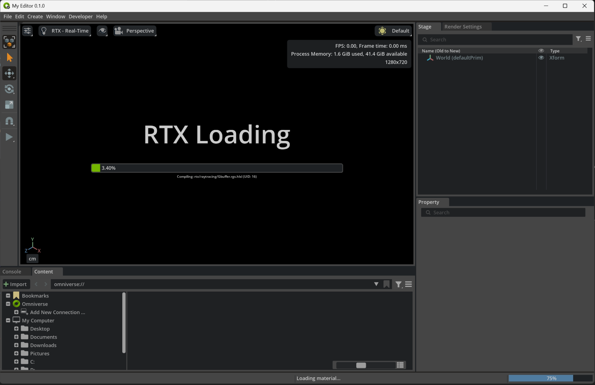
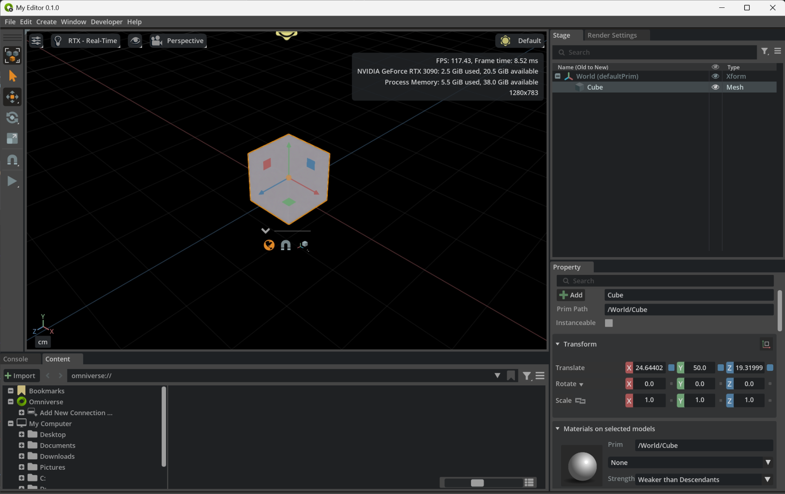
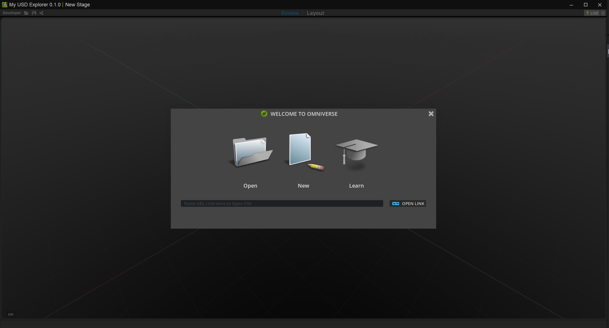
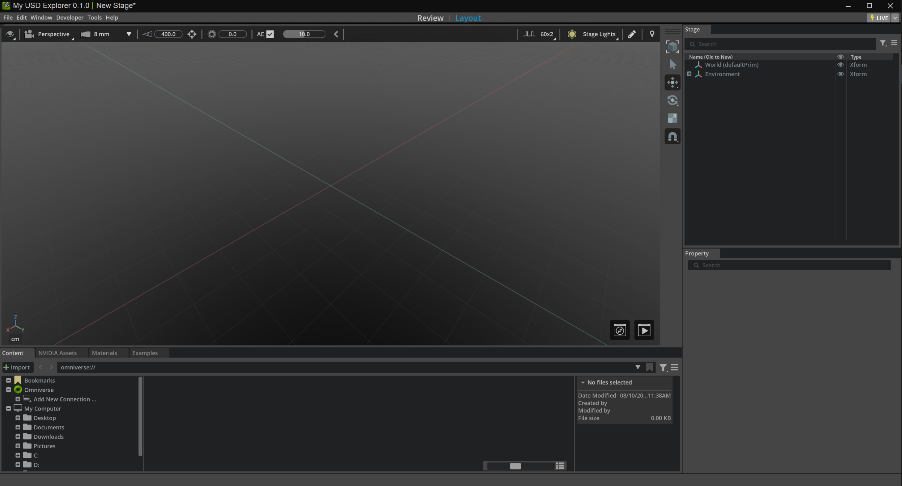
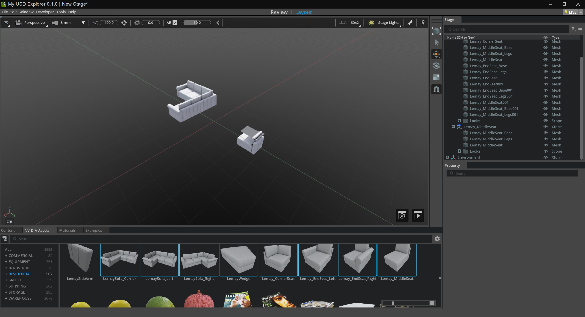

# Omniverse Kit

## Course: An Introduction to Developing With NVIDIA Omniverse
[link](https://learn.nvidia.com/courses/course-detail?course_id=course-v1:DLI+S-OV-11+V1)

An Omniverse application is defined by a .kit file, a text file that references all the application’s extensions and settings.

The Kit App Template repo is located at
https://github.com/NVIDIA-Omniverse/kit-app-template

```bash
(py312) lkk@lkk-intel13:~/Developer$ git clone https://github.com/NVIDIA-Omniverse/kit-app-template
(py312) lkk@lkk-intel13:~/Developer$ cd kit-app-template/
(py312) lkk@lkk-intel13:~/Developer/kit-app-template$ ls
CHANGELOG.md  PRODUCT_TERMS_OMNIVERSE  repo.bat   repo_tools.toml  tools
LICENSE       readme-assets            repo.sh    SECURITY.md
premake5.lua  README.md                repo.toml  templates
```

## Kit Base Editor template

In this step, you will use one of the tools included with Kit to create a basic application.
```bash
(py312) lkk@lkk-intel13:~/Developer/kit-app-template$ ./repo.sh template new
Creating packman packages cache at /home/lkk/.cache/packman
Fetching python@3.10.17-nv1-linux-x86_64.tar.gz from bootstrap.packman.nvidia.com ...
Unpacking python
Fetching packman-common@7.29.zip from bootstrap.packman.nvidia.com ...
Unpacking ...
Package successfully installed to /home/lkk/.cache/packman/packman-common/7.29
Pip installing dependencies from /home/lkk/.cache/packman/chk/repo_man/1.84.7/tools/uv/uv-requirements.txt to /home/lkk/.cache/packman/chk/uv_deps/50fa2d6354593bc84586cb1856af2077/linux-x86_64/3.10.17...
By downloading or using the software and materials provided, you agree to the governing terms:

The software and materials are governed by the NVIDIA Software License Agreement and the Product-Specific Terms for NVIDIA Omniverse.

? Do you accept the governing terms? Yes
[CTRL+C to Exit]
? Select what you want to create with arrow keys ↑↓: Application>
? Select desired template with arrow keys ↑↓: [kit_base_editor]: Kit Base Editor
 
? Enter name of application .kit file [name-spaced, lowercase, alphanumeric]: my
_company.my_editor
? Enter application_display_name: My Editor
? Enter version: 0.1.0
Application 'my_company.my_editor' created successfully in /home/lkk/Developer/kit-app-template/source/apps/my_company.my_editor.kit

The application template you have selected has optional linked applications and layers.
? Do you want to add application layers? No

(py312) lkk@lkk-intel13:~/Developer/kit-app-template$ ls source/apps/
my_company.my_editor.kit
```

Note that the contents of the .kit file are textual, making it straightforward to read and edit. The .kit file is basically a manifest of what you want to pull from the Omniverse ecosystem to use in your application. Everything listed in the .kit file is a building block for the application.

To be able to run the application, you need to build it first. The build process compiles your application and its extensions, preparing them for launch.

```bash
(py312) lkk@lkk-intel13:~/Developer/kit-app-template$ ./repo.sh build
....
BUILD (RELEASE) SUCCEEDED (Took 322.40 seconds)

(py312) lkk@lkk-intel13:~/Developer/kit-app-template$ ./repo.sh launch
```

Windows: Run in Admin PowerShell (Important). Right-click PowerShell → Run as Administrator.
```bash
lkk68@NEWALIENWARE D:\Developer>git clone https://github.com/NVIDIA-Omniverse/kit-app-template
lkk68@NEWALIENWARE D:\Developer>cd kit-app-template
lkk68@NEWALIENWARE D:\Developer\kit-app-template>.\repo.bat template new
lkk68@NEWALIENWARE D:\Developer\kit-app-template>.\repo.bat build
.....
>>> VS Code setup. Writing: D:\Developer\kit-app-template\_build\windows-x86_64\release\setup_python_env.bat
>>> VS Code setup. Writing: D:\Developer\kit-app-template\_build\windows-x86_64\release\site\sitecustomize.py
>>> VS Code setup. Writing: D:/Developer/kit-app-template/.vscode/settings.json
BUILD (RELEASE) SUCCEEDED (Took 269.23 seconds)

D:\Developer\kit-app-template> .\repo.bat launch
```

When the launch process is complete, your Omniverse application will open in a new window. It may take a few minutes for RTX to load the first time. When RTX is finished loading, continue to the next step. 



### Application Structure

The application features four main menus: **File**, **Edit**, **Create**, and **Window**. These menus are defined by specific extensions in the `.kit` file.

The following extensions create the application menus:

```
"omni.kit.menu.file" = {}    # File menu
"omni.kit.menu.edit" = {}    # Edit menu
"omni.kit.menu.create" = {}  # Create menu
```

The application's interface components are created by extensions that start with `omni.kit.window`:

```
"omni.kit.window.console" = {}         # Console/log
"omni.kit.window.content_browser" = {} # Content browser
"omni.kit.window.property" = {}        # Property editor
"omni.kit.window.stage" = {}           # Stage tree
"omni.kit.window.status_bar" = {}      # Status bar
"omni.kit.window.toolbar" = {}         # Manipulator toolbar
```

These extensions create interface elements such as the Stage tree and Property editor. They also automatically add these components to the **Window** menu. Since windows are essential parts of any application, the Window menu is always created, providing access to all application windows.

### Create a Cube
In the application’s Toolbar, select Create > Mesh > Cube to create a cube in the Viewport. There should now be a Cube listed in the Stage area. 



Move the cube around by selecting the Move tool in the left toolbar, or by clicking the W key on your keyboard, and dragging one of the arrows on the transform widget. 
    - Click and hold your right mouse button (RMB) on the viewport and navigate around the scene with WASD while holding down RMB.
    - Adjust camera speed with the middle scroll wheel while holding down RMB.
    - Adjust the camera angle by dragging with RMB.
    - These can all be done in combination; for example, hold down RMB and drag while using WASD to move and rotate at the same time.
    - If you lose the cube during navigation, press the F key to focus the viewport on the cube.

## Kit USD Explorer template

```bash
(base) PS D:\Developer\kit-app-template> .\repo.bat template new
[CTRL+C to Exit]
? Select what you want to create with arrow keys ↑↓: Application>
? Select desired template with arrow keys ↑↓: [omni_usd_explorer]: USD Explorer
? Enter name of application .kit file [name-spaced, lowercase, alphanumeric]: my_company.my_usd_explorer
? Enter application_display_name: My USD Explorer
? Enter version: 0.1.0

The application template you have selected requires a setup extension.
Setup Extension -> omni_usd_explorer_setup
Configuring extension template: Omni USD Explorer Setup
? Enter name of extension [name-spaced, lowercase, alphanumeric]: my_company.my_usd_explorer_setup_extension
? Enter extension_display_name: My USD Explorer Setup Extension
? Enter version: 0.1.0
Extension 'my_company.my_usd_explorer_setup_extension' created successfully in D:\Developer\kit-app-template\source\extensions\my_company.my_usd_explorer_setup_extension
Application 'my_company.my_usd_explorer' created successfully in D:\Developer\kit-app-template\source\apps\my_company.my_usd_explorer.kit

The application template you have selected has optional linked applications and layers.
? Do you want to add application layers? No
```

In VS Code, locate the new .kit file under source > apps > my_company.my_usd_explorer.kit and open it in the Editor window.

Type the following command, which will build the last template you created:
```bash
 D:\Developer\kit-app-template> .\repo.bat build
....
BUILD (RELEASE) SUCCEEDED (Took 85.82 seconds)

(base) PS D:\Developer\kit-app-template> .\repo.bat launch
[ctrl+c to Exit]
? Select with arrow keys which App you would like to launch:
  ApplicationTemplate
########################################################################
❯ my_company.my_editor.kit
  my_company.my_usd_explorer.kit
```
Select the new `my_company.my_usd_explorer.kit` in the list.Wait a few moments while the launch process completes, and the application will open in a new window.


Select the `New` option to enter the Layout display.


At the lower left of the screen, click the NVIDIA Assets tab. Navigate through the folders to find an asset, and double-click to open it. You can also drag individual assets into the viewport or the Stage window.


## Add Extension
Extensions are isolated units of application functionality defined via either Python or C++ code. Extensions that serve as the building blocks of Omniverse Kit-based applications.

An application, on startup, references the list of extensions in its .kit file and loads those extensions as part of the application’s appearance and functionality. Each template places several extensions in its .kit file to provide a baseline of functionality, with the expectation that developers will add additional extensions to build out a custom application.

In your application’s .kit file, extensions are listed in the [dependencies] section. Adding an extension is as simple as adding a line of code at the end of the [dependencies] list. You can find the code by searching the Extensions window.

In your USD Explorer .kit file, paste this code to the end of the [dependencies] section: `"omni.kit.stage_column.variant" = {}`. This extension adds an option to display a Variant column in the Stage window. 

Save the .kit file, then build and launch the application again. In the Stage window, click the Options button at the upper right of the window. From the dropdown menu, select Columns > Variant. A Variant column appears in the Stage window.

Launch the USD Explorer application with the -d parameter:
```bash
Windows: .\repo.bat launch -d
Linux: ./repo.sh launch -d
```
Click New to open Layout mode.
Open the Extensions window from the Window menu.
Search for omni.kit.window.extensions, and select the Extensions listing.