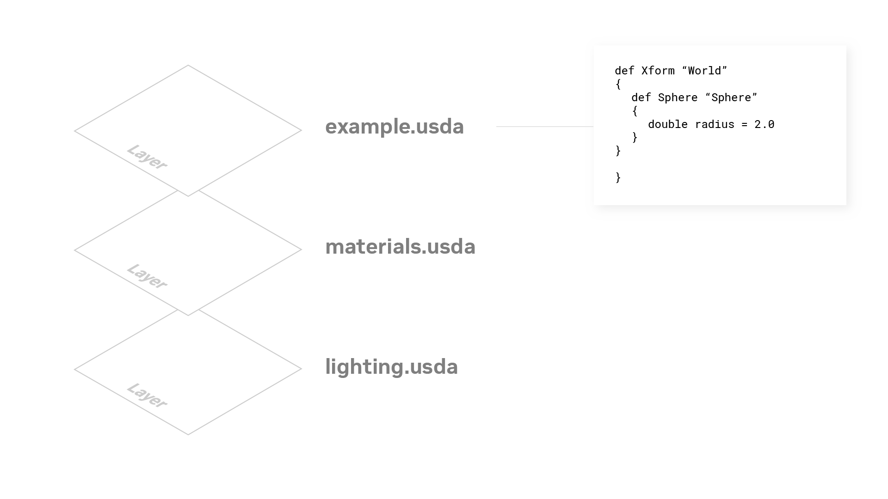
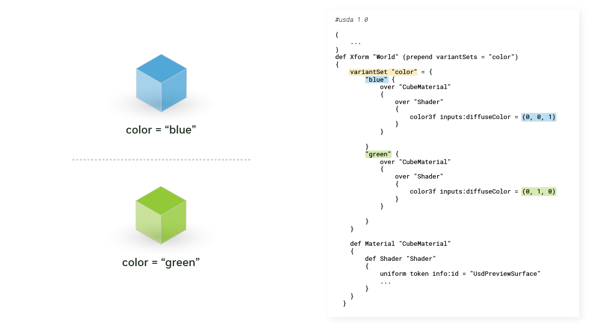

# OpenUSD Applied Concepts

Build on foundational knowledge to explore advanced topics in OpenUSD, preparing developers and practitioners to use Universal Scene Description effectively in practical workflows.

## Course 1: Learn OpenUSD: Creating Composition Arcs

This course covers advanced USD composition techniques and practical implementation strategies:

- **Layers and Sublayers**: Organize and structure USD scene data effectively
- **References and Payloads**: Build modular and efficient USD scenes
- **Encapsulation Techniques**: Apply proper data organization methods
- **Variant Sets**: Create flexible asset variations within USD scenes
- **Inherits and Specializes**: Create hierarchical relationships and optimize scene composition
- **LIVRPS Strength Ordering**: Predict and control USD composition results
- **Debugging**: Troubleshoot complex USD compositions using usdview and Python

## Setup and Installation

### Installing usdview
**Documentation**: [usdview Quickstart Guide](https://docs.omniverse.nvidia.com/usd/latest/usdview/quickstart.html)

**usdview** is compatible with Linux, macOS, and Windows. These instructions are primarily for Windows and Linux users. macOS users can run usdview but must build it from the [OpenUSD repository](https://github.com/PixarAnimationStudios/OpenUSD).

#### Download and Setup

1. Visit [NVIDIA's OpenUSD developer resources page](https://developer.nvidia.com/usd)
2. Download **Pre-Built OpenUSD Libraries and Tools** (USD 25.05, Python 3.11)
3. Extract the downloaded archive (this may take several minutes)
4. Rename the extracted folder to `usd_root`

#### Linux Prerequisites

For Ubuntu systems, install the required X11 dependencies before proceeding:

```bash
sudo apt-get install libxkbcommon-x11-0 libxcb-xinerama0 libxcb-image0 \
                    libxcb-shape0 libxcb-render-util0 libxcb-icccm4 \
                    libxcb-keysyms1
```

> **Note**: Tested on Ubuntu 22.04 LTS and 24.04 LTS. Adjust the command for other Linux distributions as needed.

#### Running usdview

Navigate to the `usd_root/` folder in your terminal and run:

**Windows:**
```cmd
.\scripts\usdview_gui.bat
```

**Linux/macOS:**
```bash
./scripts/usdview_gui.sh
```

This opens usdview with the HelloWorld.usda file. The `usdview_gui` script doesn't require a USD file argument, while `usdview` requires a specific USD file path.

#### Adding to PATH (Optional)

For convenient access, add the `scripts/` folder to your PATH environment variable:

**Windows:**
1. Open Start menu → Type "SystemPropertiesAdvanced" → Press Enter
2. Click "Environment Variables..."
3. Double-click the "Path" row in User variables
4. Click "New" and add the full path to your `scripts/` folder
5. Test with: `usdview_gui.bat`

**Linux/macOS:**
```bash
export PATH=<PRE-BUILT BINARIES DIR>/scripts:$PATH
# Test with:
usdview_gui.sh
```

### Setting Up OpenUSD Python Environment

The prebuilt OpenUSD binaries include a compatible Python version located in the `python/` folder.

#### Creating Virtual Environment

Create a virtual Python environment in the `usd_root/` directory:

**Windows:**
```cmd
.\python\python.exe -m venv .\pyusd-venv
```

**Linux/macOS:**
```bash
./python/python -m venv ./pyusd-venv
```

#### Activating the Environment

**bash/zsh:**
```bash
source pyusd-venv/bin/activate
```

<!-- **Windows Command Prompt:**
```cmd
pyusd-venv\Scripts\activate.bat
``` -->

**Windows PowerShell:**
```powershell
(base) PS D:\IsaacSim\usd_root> pyusd-venv\Scripts\Activate.ps1
(pyusd-venv) (base) PS D:\IsaacSim\usd_root> 
```

> **PowerShell Note**: You may need to set the execution policy first:
> ```powershell
> Set-ExecutionPolicy RemoteSigned -Scope CurrentUser
> ```

#### Alternative Setup Method

You can also use the provided environment scripts:

**Windows:**
```cmd
set_usd_env.bat
```

**Linux/macOS:**
```bash
source set_usd_env.sh
```

### Installing Required Packages

#### USD Core Library

Install **usd-core**, which provides access to the USD API:

```bash
(pyusd-venv) (base) PS D:\IsaacSim\usd_root> python -V
Python 3.11.11
(pyusd-venv) (base) PS D:\IsaacSim\usd_root> pip list            
Package    Version
---------- -------
pip        24.3.1
setuptools 70.3.0
(pyusd-venv) (base) PS D:\IsaacSim\usd_root> pip install usd-core
```

**Verify installation:**
```bash
(pyusd-venv) (base) PS D:\IsaacSim\usd_root> python -c "from pxr import Usd; print(Usd.GetVersion())"
(0, 25, 8)
```

#### Additional Dependencies

**Install Assimp for 3D model processing:**
```bash
pip install assimp-py
```

**Verify Assimp installation:**
```bash
python -c "import assimp_py"
```

### Course Materials

This course includes hands-on activities. Download the required files:

📁 **[Course Files Download](https://learn.learn.nvidia.com/assets/courseware/v1/cf960309f12f0890cce592bbaf41c1d9/asset-v1:DLI+S-OV-25+V1+type@asset+block/composition-arcs-course-files.zip)**

**Setup Instructions:**
1. Extract the downloaded archive
2. Copy the `composition_arcs` folder to your `usd_root/` directory
3. You can drag and drop it into Visual Studio Code's Explorer panel

### Additional Resources

Access sample USD content and assets:

🎨 **[USD Content Samples](https://docs.omniverse.nvidia.com/usd/latest/usd_content_samples/downloadable_packs.html)**

---

## Core USD Concepts

### Prims: The Foundation of USD

A **prim** (primitive) is the primary container object in USD that can:
- Contain and organize other prims in a hierarchy
- Hold various types of data (geometry, materials, transforms, etc.)
- Be composed from multiple **primSpecs** and **propertySpecs**

#### Understanding Specs and Opinions

**Specs** are the building blocks of USD composition:
- **primSpecs**: Define prim-level data and metadata
- **propertySpecs**: Define attribute and relationship data
- **Opinions**: The actual authored values stored in specs within layers


#### Property Types

Properties in USD come in two main forms:
- **Attributes**: Store data values (positions, colors, etc.)
- **Relationships**: Define connections between prims

This means propertySpecs include both **attributeSpecs** and **relationshipSpecs**.

#### Working with Specs

Interact with specs using the **Sdf (Scene Description Foundations) API**:
- `SdfSpec`: Base API for all specs
- `SdfPrimSpec`: API for prim specifications
- `SdfPropertySpec`: API for property specifications

> **Example**: In the image above, `Sphere` is a primSpec, `radius` is a propertySpec, and `1.0` is the opinion value.

### Layers: Collaborative Scene Composition



#### What are Layers?

A **layer** is a single USD document (file or hosted resource) that contains:
- Prims and properties defined as **primSpecs** and **propertySpecs**
- Sparse definitions that contribute to the final composed scene
- Independent data that can be authored by different **workstreams**

#### Collaborative Workflow Benefits

**Workstreams** are different data producers in a project:
- Teams, users, departments
- Services, applications, tools
- Each authors data to separate layers independently

This enables USD's core strength: **collaborative, non-destructive editing**.

#### Layer Applications

Layers are essential for:
- **Organization**: Structure content logically
- **Optimization**: Enable deferred loading (Payloads)
- **Instancing**: Efficient scene reuse
- **Collaboration**: Parallel development workflows

### Sublayers: Strength-Ordered Composition

**Sublayers** are ordered lists of USD layers where:
- **First layer = Strongest opinions**
- **Last layer = Weakest opinions**
- Each layer overlays on others, providing additional opinions
- Contents are included without remapping

#### When to Use Sublayers

Sublayers excel in large scene workflows:

**Example Scenario:**
- **Lighting team** → Works in `lighting.usd`
- **Layout team** → Works in `layout.usd`
- **Animation team** → Works in `animation.usd`

**Benefits:**
- ✅ Independent, parallel development
- ✅ No blocking between teams
- ✅ Automatic integration of changes
- ✅ Manageable, smaller files


### Practical Exercise

Explore the composition examples:

```
composition_arcs/sublayers/simple_example/
├── sublayerA.usd
├── sublayerB.usd
└── sublayers_simple.usd
```

#### Understanding "Over" Prims

**Over** (short for "override" or "compose over"):
- Provides neutral containers for overriding opinions
- Doesn't change the resolved specifier when stronger than `def` or `class`
- Used for authoring overriding opinions on existing prims

**Example**: In `sublayerB.usda`, an `over` prim provides overriding opinions for the `Geometry` prim, defining a `Sphere` within it.

### Advanced Composition Arcs

### References and Payloads: Asset Reuse and Performance

**References** and **payloads** are essential composition arcs for managing complex scenes, reusing assets, and optimizing performance in USD workflows.

#### References: Modular Asset Composition

**What are References?**

References enable you to create multiple copies of the same content by grafting a prim hierarchy from one layer onto a prim in another layer. This makes them ideal for:
- **Modularity**: Compose smaller asset units into larger aggregates
- **Reusability**: Use the same assets across different scenes
- **Collaboration**: Enable parallel development by multiple contributors

**Key Characteristics:**
- **Path Translation**: Referenced prims undergo name changes and path translations to fit their new namespace
- **External/Internal**: Can target prims from different layers (external) or within the same layer (internal)
- **Always Loaded**: References are always composed and present on the stage

**Use Case Example:**
A digital twin of a factory environment can consist of various assets from disparate sources:
- Boxes, machinery, conveyor belts, shelving
- Each asset referenced multiple times to build the complete factory
- Reduces duplication while enabling modular assembly

**Viewing References in usdview:**

**Windows:**
```cmd
.\scripts\usdview.bat .\composition_arcs\references\simple_example\red_cube.usd
```

**Linux:**
```bash
./scripts/usdview.sh ./composition_arcs/references/simple_example/red_cube.usd
```

#### Payloads: On-Demand Loading


**What are Payloads?**

Payloads are similar to references but with the crucial ability to **load and unload content on demand**. This enables efficient memory management and faster scene navigation.

**Key Benefits:**
- **Deferred Loading**: Load only the assets you need to inspect
- **Memory Efficiency**: Reduce memory usage by unloading unnecessary content
- **Performance**: Faster scene loading and improved interactivity
- **Selective Composition**: Load specific payloads while keeping others unloaded

**Workflow Example:**
1. **Load Stage**: Open a city scene with all payloads unloaded (fast loading)
2. **Navigate**: Browse the scene hierarchy to find areas of interest
3. **Selective Loading**: Load only the city block or assets you want to inspect
4. **Compose**: Data from loaded payloads and their dependencies gets composed into the scene

**Composition Characteristics:**
- **List-Editable**: Can be applied to the same prim in lists, like references
- **Weaker Strength**: Lower priority than references in LIVRPS ordering
- **Recursive Unloading**: Unloading a payload also unloads all its descendants

**Testing Payloads in usdview:**

```bash
.\scripts\usdview.bat .\composition_arcs\payloads\simple_example\red_cube.usd
```

**Key Observation**: When selecting "Unload" in usdview, all descendants disappear from the tree view, demonstrating payload's ability to completely remove scene description from composition.

---

### Encapsulation: Asset Self-Containment

**Encapsulation** refers to organizing assets in a self-contained manner, ensuring all dependencies are included when referencing or composing assets.

#### Understanding Encapsulation

**What is Encapsulation?**
- A prim is **encapsulated** when it is an ancestor of the referenced target prim
- When encapsulated, the prim will be referenced along with its ancestor
- Promotes **modularity** and **reusability** across projects

#### Encapsulation vs. Unencapsulation

**Unencapsulated Assets:**
- Missing dependencies when referenced
- Can break material bindings and relationships
- Example: Referencing `unencapsulated.usd` brings the cube but loses the red material binding

**Properly Encapsulated Assets:**
- Include all necessary dependencies within the asset hierarchy
- Maintain material bindings and relationships when referenced
- Self-contained and portable across different contexts

#### Best Practices

**Proper Encapsulation Techniques:**
- **Hierarchical Organization**: Organize prims within a root prim container
- **Default Prims**: Use default prims as main entry points for assets
- **Dependency Inclusion**: Ensure all materials, textures, and relationships are included
- **Self-Containment**: Assets should work independently when referenced

#### Practical Example

**Good Encapsulation Example:**
```bash
.\scripts\usdview.bat .\composition_arcs\references\encapsulation_example\encapsulated_GOOD.usd
```

**Key Benefits:**
- ✅ **Modularity**: Assets work across different projects
- ✅ **Reliability**: No broken dependencies when referencing
- ✅ **Maintainability**: Easier to manage and update assets
- ✅ **Collaboration**: Teams can work with assets independently

#### Default Prims

**Default prims** serve as the main entry point for assets:
- Automatically selected when referencing or payloading
- Simplify asset usage and composition
- Enable consistent asset behavior across different contexts

---

### Variant Sets: Runtime Asset Variations

**Variant Sets** enable you to define multiple variations or alternative representations of the same asset that can be switched at runtime, providing flexible content management without duplicating assets.

#### What are Variant Sets?

**Core Concept:**
- Define **variations** (called "variants") of the same dataset
- Switch between variations at runtime
- Only the **selected variant** is composed on the stage
- All other variants are ignored during traversal

#### Common Use Cases

**Character Outfits Example:**
- Single character asset with multiple clothing options
- Variant set controls which outfit appears in each shot
- Eliminates need to manage separate character + clothing combinations
- Reduces complexity and asset management overhead

**Other Applications:**
- **Level of Detail (LOD)**: High/medium/low resolution variants
- **Material Variations**: Different surface treatments for the same geometry
- **Seasonal Changes**: Summer/winter versions of environments
- **Configuration Options**: Different equipment or accessory combinations

#### How Variant Sets Work

**Variant Set Structure:**
- **Variant Set**: Controller that manages variations
- **Variants**: Individual variation options within the set
- **Selection**: Only one variant active at a time
- **Scope**: Can manipulate the prim and any descendant prims

#### Variant Capabilities

**What Variants Can Do:**
- **Override Properties**: Sparsely modify attributes on any descendant prim
- **Add Geometry**: Include additional prims or components
- **Material Changes**: Switch materials, textures, or shading
- **Transform Modifications**: Adjust positions, rotations, or scales



**Example**: Two variants override the diffuse color of a cube material:
- **Blue Variant**: Sets material color to blue
- **Green Variant**: Sets material color to green

#### Best Practices

**Variant Set Design Guidelines:**
- **Limited Scope**: Keep variant changes predictable and focused
- **Clear Naming**: Use descriptive names for variant sets and variants
- **Consistent Structure**: Maintain similar prim hierarchies across variants
- **Performance Consideration**: Avoid overly complex variant combinations

#### Practical Example

**Testing Variant Sets:**
```bash
.\scripts\usdview.bat .\composition_arcs\variant_sets\simple_example\variant_sets_simple.usd
```

**In usdview:**
1. Select different variants from the variant set dropdown
2. Observe how the scene changes based on the selected variant
3. Note that only one variant is active at any time

---

### Inherit and Specialize Arcs: Advanced Inheritance Patterns

#### Inherit Arcs: Broadcast Inheritance

**What are Inherit Arcs?**

Inherit arcs share similarities with programming inheritance, enabling prims to inherit properties and structure from other prims with **broadcast capabilities** across layer stacks.

**Key Characteristics:**
- **Source Prim**: The prim being inherited from (often uses "class" specifier)
- **Destination Prim**: The prim that inherits properties
- **Broadcast Updates**: Changes to source prim propagate to all inheriting prims
- **Cross-Layer Stack**: Works across references and different layer stacks

**Example**: `/World` prim inherits from `/_cube_asset`, applying all properties and descendants from the source hierarchy.

#### When to Use Inherit Arcs

**Ideal Use Cases:**
- **Reusable Assets**: Define assets meant to be inherited by multiple prims
- **Global Updates**: Apply changes to all instances of an asset simultaneously
- **Unencapsulated Sources**: Use with unencapsulated inherit source prims for maximum flexibility
- **Asset Libraries**: Create base assets that can be customized per instance

**Workflow Benefits:**
1. **Global Namespace**: Source prim becomes editable at any stronger layer
2. **Broadcast Changes**: Modifications propagate to all inheriting prims automatically
3. **Individual Overrides**: Specific instances can still be customized in stronger layers
4. **Cross-Reference**: Works across different layer stacks and references

#### Class Specifier

**Why Use "class" Specifier?**

When authoring prims meant for inheritance, use the **"class" specifier**:

**Benefits:**
- **Communication**: Clearly indicates the prim is designed for inheritance
- **Rendering Behavior**: Hydra doesn't render "class" prims or their descendants
- **Abstract Data**: Perfect for purely abstract/template data
- **Performance**: Avoids unnecessary rendering of template prims

---

#### Specialize Arcs: Fallback Inheritance

**What are Specialize Arcs?**

Specialize arcs provide **fallback-based inheritance**, similar to traditional object-oriented programming inheritance patterns.

**Key Differences from Inherit:**
- **Fallback Values**: Specs are applied only when no stronger opinion exists
- **OOP-Style**: Behaves like traditional class inheritance
- **Conditional Application**: Only applies if destination prim lacks the specific spec
- **Weaker Strength**: Lowest priority in LIVRPS ordering

#### When to Use Specialize Arcs

**Traditional OOP Inheritance:**
- **Default Values**: Provide fallback values for properties
- **Class-like Behavior**: Objects inherit from classes but can override members
- **Conditional Updates**: Changes to "class" only affect objects still using default values
- **Selective Inheritance**: Objects with overrides ignore class updates

**Behavior Comparison:**

| Aspect | Inherit Arcs | Specialize Arcs |
|--------|--------------|------------------|
| **Update Propagation** | Always broadcasts | Only to non-overridden specs |
| **Override Behavior** | Can be overridden in stronger layers | Overrides ignore source updates |
| **Use Case** | Global asset updates | Traditional OOP inheritance |
| **Strength** | Stronger ("I" in LIVRPS) | Weakest ("S" in LIVRPS) |

---

### LIVRPS Strength Ordering: Composition Resolution Rules

#### Understanding LIVRPS

**What is LIVRPS?**

LIVRPS is a fundamental concept in USD that governs how different composition arcs are applied when creating a scene. This acronym captures all operations used to compose data from layers onto the stage, **in the order of their strength**.

**Why Strength Ordering Matters:**
- **Multiple Opinions**: USD allows multiple layers and composition operations to define the same property
- **Conflict Resolution**: Strength ordering determines which opinion "wins" in the final composed stage
- **Predictable Results**: Ensures consistent and predictable composition behavior
- **Hierarchical Control**: Stronger operations can override weaker ones

#### Layer Stack Foundation

**What is a Layer Stack?**


A **layer stack** is the ordered set of layers resulting from:
1. **Root Layer**: The primary layer (strongest)
2. **Sublayers**: All recursively gathered sublayers
3. **Local Composition**: Internal references, payloads, variant sets, inherits, and specializes

**Key Characteristics:**
- **Strength-Ordered**: First layer is strongest, subsequent layers are progressively weaker
- **Recursive Gathering**: Includes all nested sublayers automatically
- **Composition Context**: Each layer stack forms a complete composition context
- **Cross-Stack Operations**: Multiple layer stacks are composed using references and payloads

#### LIVRPS Breakdown

The LIVRPS acronym represents both the **composition operations** and their **application order** (strongest to weakest):

| Letter | Operation | Strength | Description |
|--------|-----------|----------|-------------|
| **L** | **Local** | Strongest | Direct opinions in current layer stack |
| **I** | **Inherit** | Strong | Broadcast inheritance from source prims |
| **V** | **Variant** | Medium-Strong | Runtime asset variations |
| **R** | **Reference** | Medium | Modular asset composition |
| **P** | **Payload** | Medium-Weak | On-demand loading composition |
| **S** | **Specialize** | Weakest | Fallback inheritance patterns |

#### Composition Order Rules

**Within Each Layer Stack:**

1. **Local Opinions** (L) - Strongest
   - Direct property values authored in the current layer
   - Immediate overrides and customizations
   - Always take precedence over composition arcs

2. **Inherit Arcs** (I)
   - Broadcast inheritance from source prims
   - Global updates propagate to all inheriting prims
   - Can be overridden by local opinions

3. **Variant Set Arcs** (V)
   - Runtime asset variations and configurations
   - Selected variants contribute their opinions
   - Weaker than inherits but stronger than references

4. **Reference Arcs** (R)
   - Modular asset composition and reuse
   - Brings in external asset hierarchies
   - Can be customized by stronger operations

5. **Payload Arcs** (P)
   - On-demand loading for heavy assets
   - Similar to references but with deferred loading
   - Slightly weaker than references

6. **Specialize Arcs** (S) - Weakest
   - Fallback inheritance patterns
   - Only applied when no stronger opinion exists
   - Traditional OOP-style inheritance behavior

#### Recursive Application

**LIVRPS in Practice:**
- **Per Layer Stack**: LIVRPS applies within each individual layer stack
- **Recursive Composition**: Each referenced/payload layer stack has its own LIVRPS ordering
- **Nested Resolution**: Composition arcs can contain other composition arcs
- **Predictable Hierarchy**: Maintains consistent strength ordering at all levels

**Example Scenario:**
```
Layer Stack A (Main Scene)
├── Local opinions (strongest)
├── Inherits from /CharacterClass
├── Variant: "damaged" selected
├── References: /assets/character.usd
└── Specializes: /defaults/character

Layer Stack B (Referenced Asset)
├── Local opinions in character.usd
├── Inherits from /BaseCharacter
└── References: /assets/geometry.usd
```

**Resolution Order:**
1. Layer Stack A's local opinions
2. Layer Stack A's inherit opinions
3. Layer Stack A's variant opinions
4. Layer Stack B (referenced) - entire LIVRPS hierarchy
5. Layer Stack A's specialize opinions


## Course2: Learn OpenUSD: Asset Structure Principles and Content Aggregation 
Download the required course files: https://learn.learn.nvidia.com/assets/courseware/v1/b80bc8cc0859b518e050eb259ed5664e/asset-v1:DLI+S-OV-33+V1+type@asset+block/asset-structure-course-files.zip

What is an asset?
An asset is a named, versioned, and structured container of one or more resources which may include composable OpenUSD layers, textures, volumetric data, and more. You’ll often come across terms like “asset”, “model”, “assembly”, “element”, “component”, “set”, “shot”, “file”, and “package” when discussing the organization of production data, a product, or a digital twin.

Asset structure facilitates reuse of this persistent data.

What makes asset structure necessary?
Asset structure plays an important role in scaling pipelines and ecosystems. Here’s why:

Content flow. Asset structures help map out the journey of content throughout production, ensuring everything runs smoothly.
Seamless collaboration. By adopting consistent conventions and patterns, asset structures reduce friction and make it easier for teams to communicate and work together.
No one-size-fits-all solution. There isn’t a universally best way to structure an OpenUSD asset, as usage and domains vary. A well-designed asset structure promotes scalability by encouraging parallel and modular workflows, minimizing complexity, and striking a balance between openness and resilience to change.

There are four key principles that contribute toward a scalable asset structure:

Legibility ensures your asset structure is easy to understand and interpret.
Modularity allows for flexibility and reusability.
Performance ensures your asset structure is efficient and optimized.
Navigability makes it easy for users to find and access the features and properties they need.
By adhering to these principles, you can create an asset structure that is not only scalable but also efficient and user-friendly. Let’s dive into each principle to understand more.

A legible asset structure should be easy to understand and help new users get up to speed quickly. 

Each asset designed to be opened as a stage or added to a scene through referencing has a root layer that serves as its foundation. This root layer, known as the asset interface layer, is structured to be the primary means of interacting with the asset.

A single asset entry point can typically be specified using the root layer’s defaultPrim metadata. OpenUSD’s composition engine will respect this metadata when referencing. Additionally, different domains (such as renderSettingsPrimPath) may introduce other methods for identifying domain-specific entry points.

To improve navigability, it’s common to partition asset structures. Partitioning a hierarchy can prevent unintentional namespace collisions between collaborators and avoid ambiguous semantics. For example, what does it mean for a Sphere to be parented to a Material?

Using scope prims is generally the best approach for these organizational primitives, as they don’t have additional semantics like xform does with transform operations.

Similarly, it may be useful to group actors and environments under partitioning scopes. This not only aids navigability but also allows users to quickly deactivate all actors or environments by deactivating the root scope.

When organizing your prim hierarchy, also consider the following:

Naming Conventions: A legible prim hierarchy should promote consistency for better readability.
Access Semantics: There are no restrictions on the fields that can be overridden on a prim, so it’s important for collaborators to establish conventions for stable editing. This could include using single or double underscores to discourage users from authoring overrides or to indicate internal use.
Embedded Context: Embed context directly into assets to hint to users that these assets are intended to be included by reference.

Products developed by organizations rarely consist of a single file. Instead, work is organized into logical, maintainable units. Similarly, assets should model workstreams into layers.

User Workstreams: Simple assets can be represented by a single layer, and it may make sense to start there for the sake of simplicity.

However, when different tools, users, and departments are responsible for contributing different prims to the final composed asset scene graph (such as geometry and materials), it can be beneficial to split the workstreams into multiple layers.

Computational Workstreams: Assets can also be divided into computational workstreams. For instance, a synthetic data simulation might be partitioned across multiple processes or machines. A layer stack can then be used to stitch the results back together.

Computational workstreams can be dynamic and may not remain consistent from one evaluation to the next. Consider a layer stack where workloads have been dynamically partitioned across multiple processes.

Some workstreams are hybrids, combining both computational and user-driven elements. For example, a layer might contribute synthesized motion on top of a hand-authored initial state created by a user.

Asset parameterization enables the reuse of content by allowing certain fields and properties to vary downstream.

There are two primary ways to parameterize assets: variant sets and primvars.

Variant Sets

Primvars are extra parameters that can be interpolated and are primarily used to provide additional data to shading contexts. In OpenUSD, primvars are inherited down the prim hierarchy and can be authored on an ancestor prim, including the entry point of an asset.

Instead of expecting users to know whether a complex asset requires payloading, many assets adopt the “reference-payload” pattern. This means their interface file is designed to be referenced, with the payload structure internal to the asset.

Important and inexpensive fields like variant sets and inherits are elevated above the payload when they are moved from the contents layer to the interface layer.

The references to the payload pattern can be used to recast a payload’s opinion ordering strength. While the example above uses an inline payload for brevity, if a mirroring resolver is used, it becomes important to keep the payload contents in separate layers.

Through composition, OpenUSD can build complex hierarchies of scenes. At the levels of complexity required for a film production shot or a factory line simulation, a single scenegraph can become difficult to navigate for both algorithms and users.

Model hierarchy (also known as kind metadata) offers a separate, higher-level view of the underlying scenegraph.

Let’s talk about two of the specific model kinds, components and assemblies.

The term component is often overloaded in many domains. It’s helpful to think of component models as roughly corresponding to consumer facing products. For example, a consumer can purchase a pen, and a consumer can purchase a house. Despite their differences in scale and complexity, both of these would be logical component models in a hierarchy.

All ancestors of a component model must have their kind metadata set to either a group or a subkind of group, such as assembly. This requirement is primarily to ensure that component discovery is efficient for composition.

Since the component model kind denotes a “leaf” asset or pruning point in the model hierarchy, component models cannot contain other component models as descendants. OpenUSD provides the “subcomponent” annotation for important prims that are outside the model hierarchy, which helps facilitate kind-based workflows. Subcomponent prims can contain other subcomponent prims.

Assemblies are groups that usually correspond with aggregate assets.

Assemblies are important groups that usually correspond to aggregate assets. If a house is a component model, then its neighborhood and city could be assembly models. In this example, a neighborhood may contain multiple intermediate group scopes in between the assembly and component for organizational purposes (say grouping trees, street lights, and architecture separately). Assembly models can contain other assembly models, group kinds, and component models.

When creating a model hierarchy, there are four essential factors to keep in mind. These hierarchies should be operational, shallow, consistent, and extensible.

Operational: Component and assembly models should be easily referenced in other contexts, and they should include all essential dependencies, such as material bindings or skeleton setups, that downstream users require.

Shallowness: Asset structures should encourage a shallow model hierarchy. The kind metadata is explicitly read during composition for all members of the model hierarchy, with costs minimized in a shallow structure. A deep model hierarchy introduces a small but measurable overhead to composition and misses out on performance gains from pruned traversals. A gprim tagged as a component is a sign that a model hierarchy is “deep”.

Consistency: As the language and expectations around components, subcomponents, and assemblies evolve within an ecosystem, it’s crucial that an asset consistently represents one of these concepts. For instance, it’s common to expect component models to be fully packaged and renderable, with their geometry and materials completely specified and organized into Geometry and Materials scopes.

Extensibility: The Kind library that ships with OpenUSD can be extended using plugin info, allowing users to define their own extensions to component, assembly, and subcomponent kinds. For example, a pipeline might want to differentiate between various levels of assemblies (such as “location” vs “world”) or types of subcomponents.

## Course3: Learn OpenUSD: Developing Data Exchange Pipelines

OpenUSD is commonly referred to as USD, which stands for Universal Scene Description. 

OpenUSD was developed by Pixar Animation Studios to address the complex 3D workflow challenges common in assembling and animating virtual worlds, where dozens of studios and specialties have to come together and collaborate on a single 3D scene.

To solve these problems, Pixar built USD with a core set of schemas to effectively describe 3D scenes, including meshes, materials, lights, and cameras. These data models describe many of the elements you would need to be able to make a 3D scene, such as those seen in an animated film, and have been used successfully by many studios as a common interchange format to pass the data between applications.

There are four common implementations for adding OpenUSD support for your data format or application:

Importers
Exporters
Standalone converters
File format plugins
At a high-level, whether your data is represented as a file format or runtime format may dictate the type of implementation, but there are other factors to consider as well.

File format plugins are a unique feature of OpenUSD. They allow OpenUSD to compose with additional file formats and even non-file-based sources, such as databases and procedurally generated content.

OpenUSD’s flexibility and modularity make it suitable for a wide range of applications and industries. These features and its universality make the challenges of data exchange very apparent:

Data exchange is typically lossy. Not every data model can be mapped directly.
Not every consumer may be interested in all the data exported by a digital content creation (DCC) tool. For example, a CAD application may not need animation data.
The content structure exported by a DCC tool may not be suitable for every organization and its workflows. There is no single content structure suitable for all end clients and organizations.
Not every client can handle the same content fidelity (e.g., high-quality offline renderer vs. real-time 3D app on a phone).


Two-Phase Data Exchange: To help with these data exchange challenges, we propose a two-phase approach: extract and transform. This is loosely inspired by Extract-Transform-Load (ETL) used in data analytics and machine learning. By following this two-phase data exchange approach, your implementation will solve many of today’s data exchange challenges and help you serve the widest range of customers.

Data exchange to OpenUSD should start with the extract phase. The goal is to translate the data to OpenUSD as directly as possible to maintain fidelity to the source format. Try to map concepts from the source format to concepts in OpenUSD as much as possible to preserve the integrity and structure of the source data.

The transform phase consists of one or more optional steps added to better meet end client and user needs. This includes:

Applying user export options.
Making changes to the content structure that deviate from the source format.
Implementing optimizations for better end client and workflow performance.

[OpenUSD Exchange SDK](https://docs.omniverse.nvidia.com/usd/code-docs/usd-exchange-sdk) helps developers design and develop their own USD I/O solutions that produce consistent and correct USD assets across diverse 3D ecosystems.

It provides higher-level convenience functions on top of lower-level USD concepts, so developers can quickly adopt OpenUSD best practices when mapping their native data sources to OpenUSD-legible data models.

Data transformation allows customers to tailor data to their specific needs. While DCC developers should ideally handle data extraction, they can leave transformation open for third-party developers to extend.

Key aspects of data transformation include:

Export options
Content re-structuring
Optimizations, e.g., mesh merging